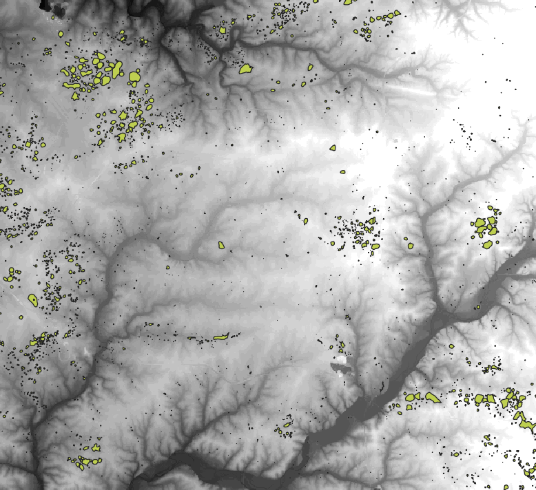
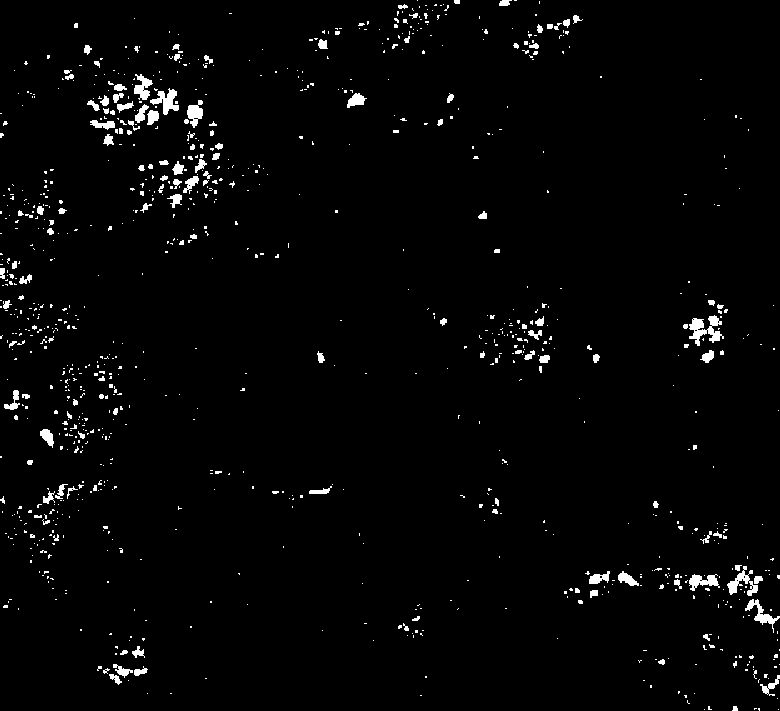
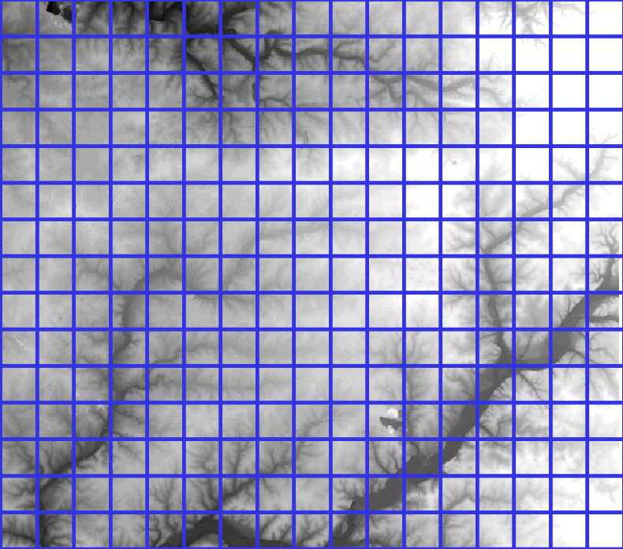
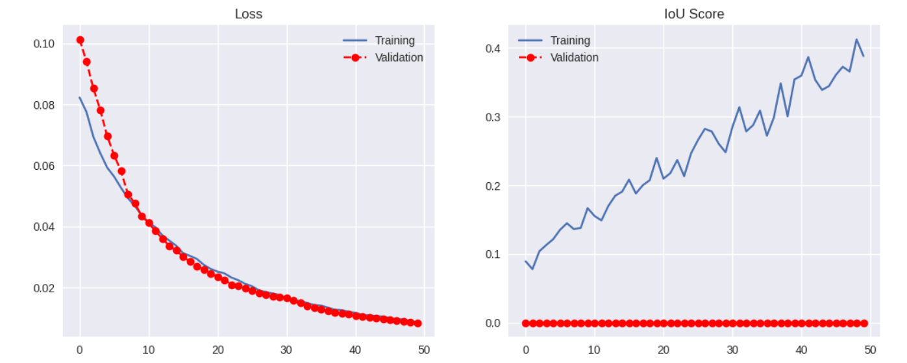

# Sinkhole Detection App

Can sinkholes be detected using LIDAR DEM imagery by training a segmentation model based on a convolutional network.

---

**DATA and DATA preprocessing**

LIDAR digital elevation model dataset: https://www.msdis.missouri.edu/

SInkhoe Bundary Dataset: https://gisdata-cosmo.opendata.arcgis.com/datasets/COSMO::sinkhole-boundaries/about

QGIS (https://www.qgis.org/en/site/) was used to preprocess data for this project. QGIS was used to 1) Reproject the sinkhole boundaries shapefile to match the coordinate reference system of the Missouri LIDAR data (EPSG:26195), 2) Convert the sinkhole boundaries shapefile into a binary raster file,

3) Clip the LIDAR data to the area of interest around the town of Springfield MO, and 4) to create a grid used to export image-mask pairs with matching names. The LIDAR dataset was 1-m resolution. Maintaing the highest resolution possible during processing was a priority. LIDAR imagery exported as JPEGs and masks exported as PNGs. 

---

**Modelling**

The JPEG-PNG pairs were used to train a segmentation model based on the U-Net (https://en.wikipedia.org/wiki/U-Net) framework. Libraries used were TensorFlow and segmentation_models. 

---
**Discussion**

It remains to be determined if this is a legitimate way of trying to predict sinkholes in an area. The model did a very bad job of predicting sinkhole presence with an Intersection over Union score of near zero for all epochs of the model training. 

Data classes are very imbalanced. Only 2.19% of the sinkhole mask pixels corresponds with a sinkhole. This model can and will be improved by taking measures to 1) filter data so that a larger proportion of the pixels correspond with sinkhole data, and 2) tuning class weights, and 3) transforming lidar data to help model training. 

